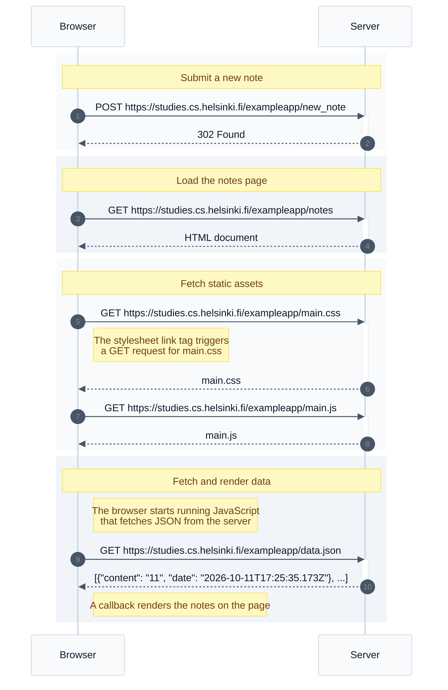

```mermaid
%%{init: {'theme':'base','themeVariables': {'primaryColor':'#ffffff','primaryBorderColor':'#cbd5e1','lineColor':'#64748b','noteBkgColor':'#fef9c3','noteBorderColor':'#fde047','noteTextColor':'#713f12','actorBkg':'#f8fafc','actorBorder':'#cbd5e1','actorTextColor':'#0f172a','signalColor':'#475569','signalTextColor':'#0f172a'}}}%%
sequenceDiagram
    autonumber
    participant B as Browser
    participant S as Server

    rect rgb(248, 250, 252)
        Note over B,S: Submit a new note
        B->>S: POST https://studies.cs.helsinki.fi/exampleapp/new_note
        activate S
        S-->>B: 302 Found
        deactivate S
    end

    rect rgb(241, 245, 249)
        Note over B,S: Load the notes page
        B->>S: GET https://studies.cs.helsinki.fi/exampleapp/notes
        activate S
        S-->>B: HTML document
        deactivate S
    end

    rect rgb(248, 250, 252)
        Note over B,S: Fetch static assets
        B->>S: GET https://studies.cs.helsinki.fi/exampleapp/main.css
        activate S
        Note right of B: The stylesheet link tag triggers<br/>a GET request for main.css
        S-->>B: main.css
        deactivate S

        B->>S: GET https://studies.cs.helsinki.fi/exampleapp/main.js
        activate S
        S-->>B: main.js
        deactivate S
    end

    rect rgb(241, 245, 249)
        Note over B,S: Fetch and render data
        Note right of B: The browser starts running JavaScript<br/>that fetches JSON from the server
        B->>S: GET https://studies.cs.helsinki.fi/exampleapp/data.json
        activate S
        S-->>B: [{"content": "11", "date": "2026-10-11T17:25:35.173Z"}, ...]
        deactivate S
        Note right of B: A callback renders the notes on the page
    end
```
