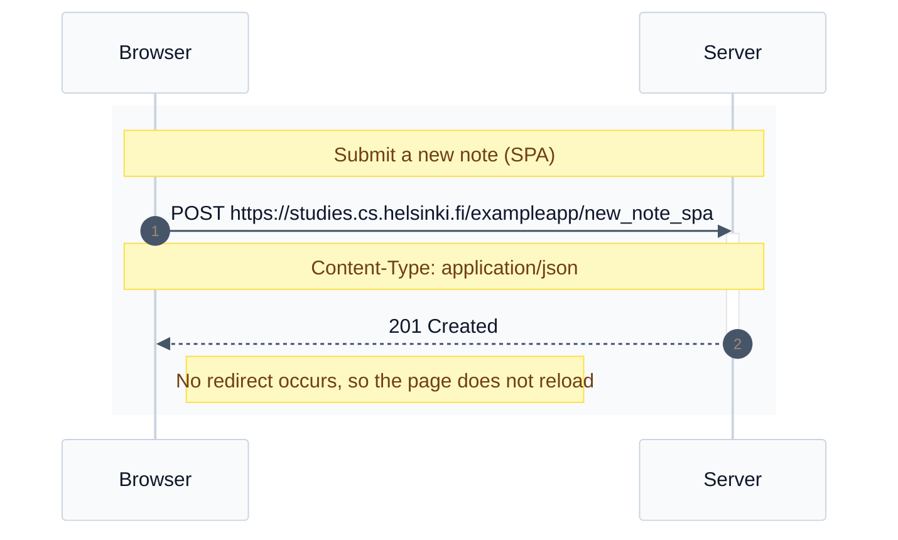

```mermaid
%%{init: {'theme':'base','themeVariables': {'primaryColor':'#ffffff','primaryBorderColor':'#cbd5e1','lineColor':'#64748b','noteBkgColor':'#fef9c3','noteBorderColor':'#fde047','noteTextColor':'#713f12','actorBkg':'#f8fafc','actorBorder':'#cbd5e1','actorTextColor':'#0f172a','signalColor':'#475569','signalTextColor':'#0f172a'}}}%%
sequenceDiagram
    autonumber
    participant B as Browser
    participant S as Server

    rect rgb(248, 250, 252)
        Note over B,S: Submit a new note (SPA)
        B->>S: POST https://studies.cs.helsinki.fi/exampleapp/new_note_spa
        activate S
        Note over B,S: Content-Type: application/json
        S-->>B: 201 Created
        deactivate S

        Note right of B: No redirect occurs, so the page does not reload
    end
```
